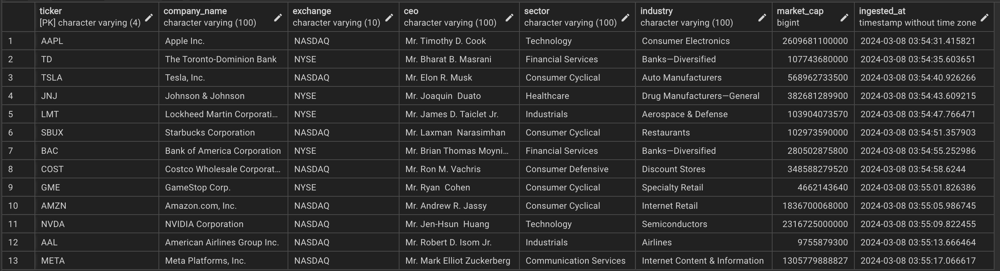
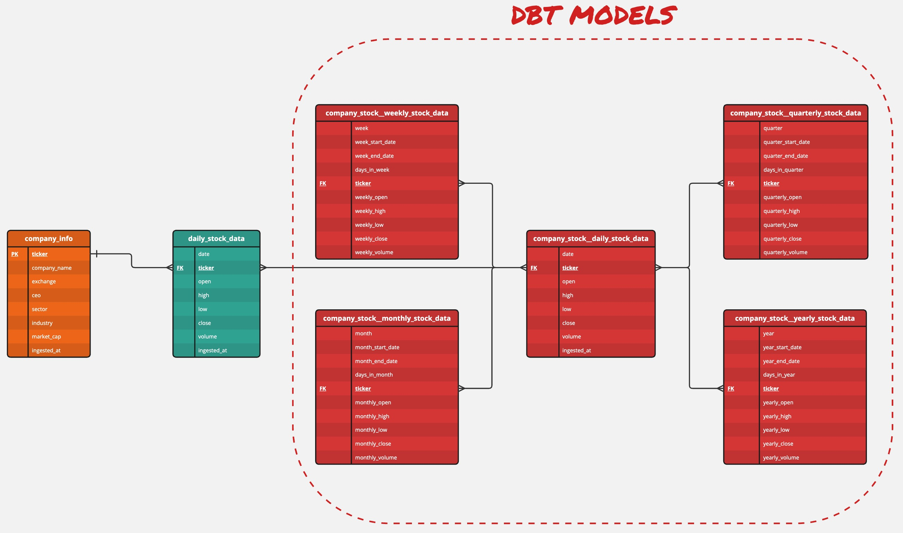
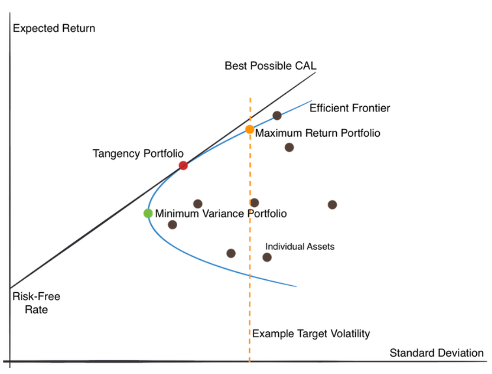

About
=====
Optimizing a stock portfolio is crucial for several reasons. Firstly, it aims to maximize returns while minimizing risk, aligning with an investor's financial 
goals and risk tolerance. By diversifying investments across various asset classes, industries, and geographic regions, portfolio optimization helps spread risk, 
reducing the impact of adverse market movements on overall returns. Additionally, optimization strategies may involve rebalancing portfolios periodically to 
maintain desired asset allocations, ensuring they remain aligned with changing market conditions and investment objectives. Ultimately, optimizing a stock 
portfolio enhances the potential for achieving long-term financial growth and stability, providing investors with greater confidence in their investment 
decisions and overall financial well-being. This project aims to do just that.

##########
Objectives
##########

* **Data Focused** (`upstream process`): Retrieve pertinent stock data from a dependable data source and securely store it in a database.
* **Analysis Focused** (`downstream process`): Leverage stored data to identify the most advantageous asset allocation for an investment portfolio, customized to the chosen stocks.

#################
Data Architecture
#################

Extract, Load, Transform (ELT) Pipeline
---------------------------------------
Instead of adhering to the conventional extract, transform, load (ETL) pipeline, I opted for an alternative approach by selecting an extract, load, transform (ELT) architecture for 3 reasons:

* **Scalability**: ELT leverages the processing power of the target database, allowing it to handle large volumes of data more efficiently
* **Simplified Architecture**: ELT simplifies the data pipeline architecture by consolidating the transformation process within the database environment. This can lead to easier maintenance and management of the data pipeline.
* **Cost-Effectiveness**: ELT often proves to be more cost-effective because it utilizes existing database infrastructure for transformation tasks as opposed to managing separate transformation servers or expensive ETL tools

.. figure:: images/api_cloud_and_local_data_architecture.png
   :alt: This is an image

   ELT architecture for ingesting stock data, storing it in either a cloud or local database, and performing portfolio optimization

Data Extraction
^^^^^^^^^^^^^^^
The data extraction process was done using two different financial APIs:

* `Financial Marketing Prep (FMP) <https://site.financialmodelingprep.com/developer/docs>`_: used to extract company info (i.e., company name, exchange, ceo, sector, industry, and market cap)
* `Y!Finance <https://pypi.org/project/yfinance/>`_: used to extract daily price data (i.e., open, high, low, close, and volume) 

Data Loading
^^^^^^^^^^^^
The Y!Finance API retrieves a decade's worth of data for each ticker and compares it with the existing database records. If a ticker is not present in the database, all 
10 years of data from Y!Finance are stored in an `Amazon S3 <https://aws.amazon.com/s3/>`_ bucket (using `Boto3 <https://boto3.amazonaws.com/v1/documentation/api/latest/guide/quickstart.html#>`_). 
This action triggers an `Amazon Lambda <https://aws.amazon.com/pm/lambda/>`_ function, which then pushes the data to a PostgreSQL instance in `Amazon RDS <https://aws.amazon.com/rds/?p=ft&c=db&z=3>`_. 
Conversely, if the ticker already exists in the database, only the new data is kept and stored.

Data Transformation
^^^^^^^^^^^^^^^^^^^
I utilized `dbt <https://docs.getdbt.com/docs/introduction>`_ (data build tool) to generate supplementary data tables with broader time intervals. By leveraging daily price data sourced from 
Y!Finance, I conducted transformations to produce four additional tables encompassing weekly, monthly, quarterly, and yearly stock information.

.. figure:: images/dbt_model.png
   :alt: This is an image

   dbt model

#################################
Entity Relationship Diagram (ERD)
#################################

The ``company_info`` table, sourced from the FMP API, functions as a reference table offering details about each ticker. It incorporates a primary key for data integrity assurance, preventing 
duplicate entries. Removal of a ticker from this table results in its deletion from any table where it serves as a foreign key.

   Company info data in PostgreSQL 

The ``daily_stock_data`` table, obtained from the Y!Finance API, possesses a foreign key linked to the ``company_info`` table, exhibiting a one-to-many relationship in terms of cardinality.

.. figure:: images/daily_stock_data_sample_data.png
   :alt: This is an image

   Daily stock data in PostgreSQL 

dbt leveraged the ``daily_stock_data`` table to generate additional tables featuring a many-to-many cardinality, all with broader timeframes. These tables were created to represent coarser 
intervals, such as weekly, monthly, quarterly, and yearly periods, through transformations facilitated by dbt.

* ``company_stock__daily_stock_data``
* ``company_stock__weekly_stock_data``
* ``company_stock__monthly_stock_data``
* ``company_stock__quarterly_stock_data``
* ``company_stock__yearly_stock_data``

   ERD created using DDL and dbt

######################
Stock Prediction Model
######################

Mean-Variance Optimization (MVO)
--------------------------------
MVO is a technique used in finance to find the optimal allocation of assets in an investment portfolio. It helps investors build portfolios that aim to maximize 
returns while minimizing the risk of losing money.

Here's a simple breakdown:

* **Mean**: refers to the expected return of an asset, which is essentially the average return you can expect over a period of time (Y-axis)
* **Variance (volatility)**: measures how much the returns of an asset fluctuate or deviate from its mean return. High variance means higher risk (X-axis)
* **Optimization**: is the process of finding the best solution given certain constraints

In MVO, the goal is to find the allocation of assets in a portfolio that maximizes expected return while minimizing risk (variance).

   MVO with Capital Allocation Line (CAL) and Efficient Frontier curve

Input Parameters
-----------------
In order to conduct MVO on a portfolio, I developed an API that accepted the following inputs:

.. list-table:: 
   :widths: 25 15 60 30
   :header-rows: 1

   * - user input
     - data type
     - description
     - example
   * - list of stock tickers
     - ``list``
     - a collection of assets that you want to include in your portfolio
     - ``AAPL``, ``TLSA``, ``MSFT``, ``GOOG``, ``NVDA``
   * - risk-free rate
     - ``float``
     - the expected return of a risk-free asset in an investment portfolio that offers a guaranteed return with zero risk
     - ``0.07``
   * - shorting allowed
     - ``bool``
     - this allows the trader to bet against the market, hoping the price will decrease instead of increase
     - ``false``
   * - maximize returns or minimize risk
     - ``bool`` 
     - achieve the highest possible return or lowest risk on an investment (maximize return = ``true``, minimize risk = ``false``)
     - ``true``

.. ##################
.. Indices and tables
.. ##################

.. * :ref:`genindex`
.. * :ref:`modindex`
.. * :ref:`search`
