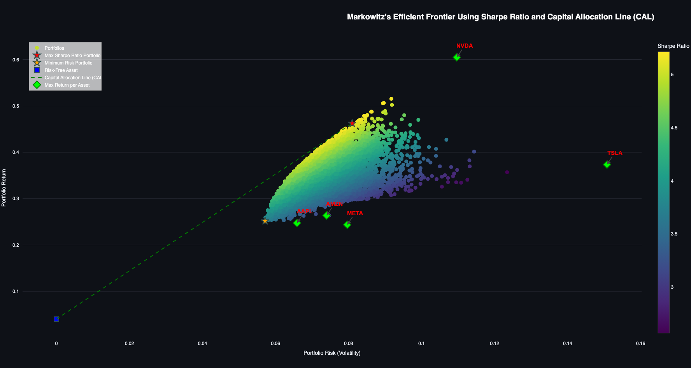

.. Allow bash inline coding. Will only include line numbers if code has 5 of more lines.
.. highlight:: bash
   :linenothreshold: 50 

Deployment
==========
The deployment of this project utilized ``Streamlit``. To deploy with ``Streamlit``, you'll have to access either the 
``local-storage`` or ``cloud-storage`` directory through Terminal, depending on your chosen setup configuration. Within this 
directory, you'll find a file named ``app.py``, which serves as the deployment script for the application.

*****************************
Using the Portfolio Optimizer
*****************************

Execute the below in Terminal to deploy the application::

   streamlit run app.py

You should see an application interface that looks like the below.

.. figure:: images/streamlit_local_deploy.png
   :width: 800
   :alt: This is an image

User Input
----------
This application accepts four key inputs from the user (see `About > Stock Prediction Model >` :ref:`Input Parameters` for more details):

* **List of Stock Tickers**:
   * **Manual input** - list of tickers seperated by a comma and a single space
   * **Upload CSV file** - this file must have one column named ``tickers`` that contains the stock symbols
* **Portfolio Settings**:
   * **Risk-free rate** - users can be enter a value by typing in a number or by using the plus(+) and minus(-) buttons to increment up and down
   * **Shorting allowed** - users can choose ``True`` or ``False`` by selecting an option from the dropdown menu
   * **Maximize returns or minimize risk** - users can choose ``maximize returns`` or ``minimize risk`` by selecting an option from the dropdown menu

**OPTIONAL: Database Settings** - when activated, this feature enables users to fetch fresh data from APIs, import it into the database, and execute transformations to generate dbt models, all without performing portfolio optimization

Generated Output
----------------

Once you've entered the essential parameters, you should choose ``Run - Manual Input`` to input tickers manually or ``Run - CSV File`` to load tickers from 
a CSV file. Upon successful execution, you'll observe the asset allocation outcomes for each ticker along with a plot demonstrating Markowitz's Efficient 
Frontier utilizing the Sharpe Ratio and Capital Allocation Line (CAL).

.. figure:: images/streamlit_asset_allocation_results.png
   :width: 800
   :alt: This is an image

